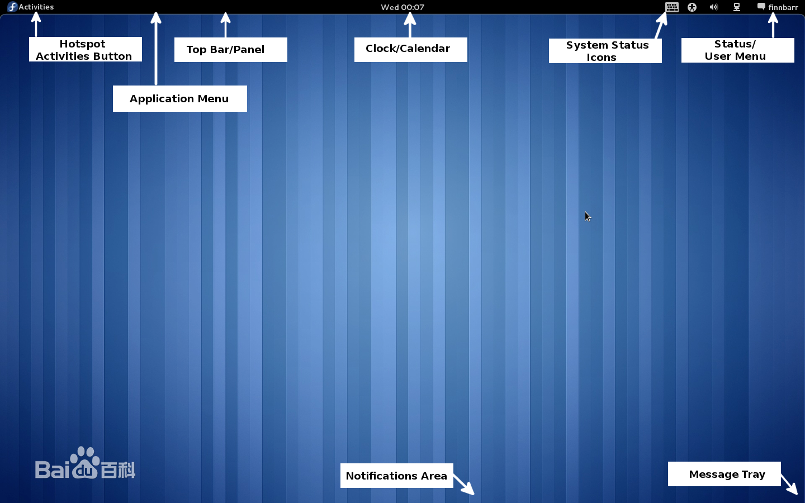
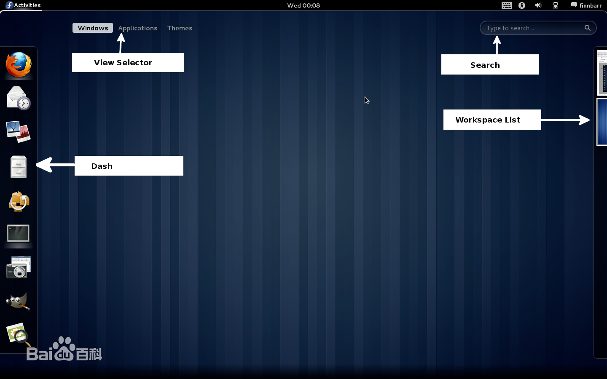

# GNOME shell

gnome shell 是一款类似gnome的桌面管理器，相对gnom

gnome shell本质上来说，是窗口管理器、应用启动器、桌面布局的集合。大多数图形代码用JavaScript写成

```
Gnome Shell 是 GNOME 3 的主要元件，它改革了 GNOME 桌面环境的操作，包括窗口管理、应用程序启动和工作空间管理的方式，为使用者提供一个全新方便易用的桌面管理方式。Gnome Shell 虽然已在 2011 年 4 月 6 日和 Gnome 3.0 一起正式推出。而同年 5 月推出的 Fedora 15 亦正式缺省使用 Gnome Shell，但仍有不少 GNU/Linux 包括 Ubuntu 11.04 等仍未提供。

目前，GNOME Shell 仍然处于早期开发阶段。开发 GNOME Shell 所用到的

Gnome Shell 桌面环境
Gnome Shell 桌面环境 [3]  
技术包括 Javascript、Clutter、以及 GNOME 平台库。混合窗口管理部分的代码来自 Metacity。由 GNOME Shell 的开发者 Owen Taylor 所提供的 GNOME Shell 截图显示，GNOME Shell 主要由包括活动面板、应用程序、最近文档、托盘图标、系统时间、已登录用户、工作区等在内的几个部分组成。 [3]  
按照 GNOME Shell 的开发计划，在 GNOME2.26 时提供可用的原型版本，到 GNOME 2.28 时加入可选的功能，最终在 GNOME 3.0 时替换现有的组件。相信目前所展现的 GNOME Shell 在未来仍有很大的可变性。
```





---
